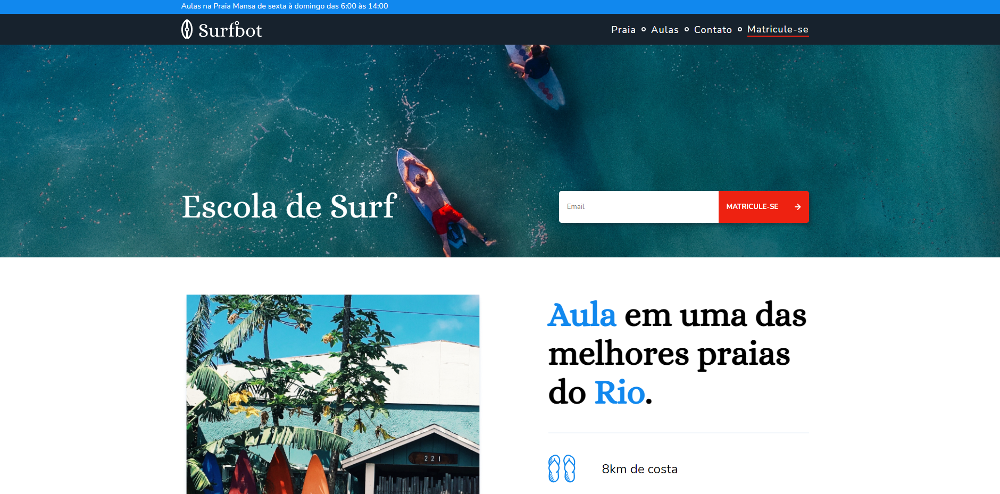
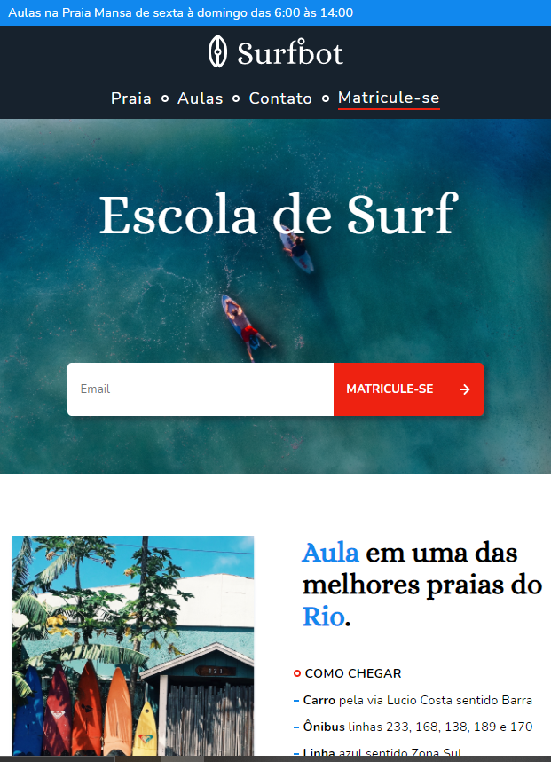

<h1 align="center">Surfbot</h1>

  

    

<h2>💻 Sobre o projeto</h2>

🏄‍♂️ Surfbot - Site desenvolvido a partir do curso de UI Design Avançado da Origamid. 

Durante o curso fizemos todo o wireframe e design de um site fictício de uma loja de surf no RJ do zero, passando pela escolha da tipografia, paleta de cores e layout do site. Utilizamos o Figma para essa construção.
Posteriormente, passei o design criado nesse curso para o código por conta própria com o objetivo de consolidar o que já aprendi de HTML e CSS até o momento. Pela primeira vez, criei algo do zero mesmo, sem um guia passo-a-passo de como transformar o design criado para uma página funcional na web.

---

<h2>🎨 Layout</h2>

O layout do site foi feito de maneira responsiva utilizando flexbox, grid e media queries, consolidando todo o conteúdo que aprendi nos cursos anteriores da Origamid.

<h3>Web</h3>

    

<h3>Mobile</h3>

    

---

<h2>🛠 Tecnologias</h2>

As seguintes ferramentas foram usadas na construção do projeto:

